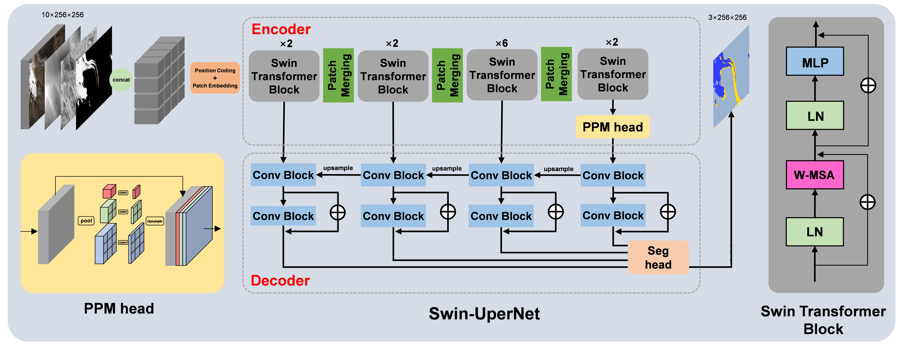

# Swin-UperNet: Transformer-based Semantic Segmentation  

  
*Example semantic segmentation results using Swin-UperNet*  

## Introduction  
Swin-UperNet is a state-of-the-art semantic segmentation framework that combines the powerful Swin Transformer backbone with the UperNet head architecture. This repository provides an implementation of the Swin-UperNet model for high-performance semantic segmentation tasks.  

**Key features**:  
- 🚀 Swin Transformer backbone for hierarchical feature extraction  
- 🔄 UperNet decoder for multi-scale feature fusion  
- ⚡️ High efficiency with linear computational complexity  
- 🏆 State-of-the-art performance on segmentation benchmarks  
- ❄️ Specialized support for glacier segmentation tasks  

## Installation  
### Prerequisites  
- Python 3.7+  
- PyTorch 1.8+  
- CUDA 11.0+  
- Linux environment recommended  

### Install via pip  
python train.py

### Training Command
To train a model on the glacier segmentation task, use the following command structure:
```bash
python train.py \
    --MODEL_TYPE upernet \
    --BACKBONE_TYPE swin_t \
    --BANDS 10 \
    --NUM_CLASS 3 \
    --DATASET_PATH ./datasets/glacier \
    --BATCH_SIZE 16 \
    --EPOCHS 100 \
    --OPTIMIZER_TYPE sgd \
    --LOSS_TYPE ce \
    --LR_SCHEDULER poly \
    --INIT_LR 0.0005 \
    --GPU_ID 0
```
**Key Parameters**:
- `MODEL_TYPE`: Model architecture (e.g., `upernet`, `deeplab`, `segnext`, etc.)
- `BACKBONE_TYPE`: Backbone network (for models that support backbones, e.g., `swin_t`, `resnet50`, etc.)
- `BANDS`: Number of input channels (10 for glacier data)
- `NUM_CLASS`: Number of classes (including background)
- `DATASET_PATH`: Path to the dataset directory
- `BATCH_SIZE`: Batch size (adjust based on GPU memory)
- `EPOCHS`: Total training epochs
- `OPTIMIZER_TYPE`: Optimizer (`sgd` or `adam`)
- `LOSS_TYPE`: Loss function (`ce` for cross-entropy or `focal` for focal loss)
- `LR_SCHEDULER`: Learning rate scheduler (`poly`, `step`, `cos`, or `exp`)
- `INIT_LR`: Initial learning rate
- `GPU_ID`: ID of the GPU to use
**Note**: The dataset should be organized in the following structure:
```
DATASET_PATH/
├── annotations/
│   ├── train.txt
│   └── val.txt
├── images/
│   ├── image1.tif
│   ├── image2.tif
│   └── ...
└── masks/
    ├── mask1.tif
    ├── mask2.tif
    └── ...
```
